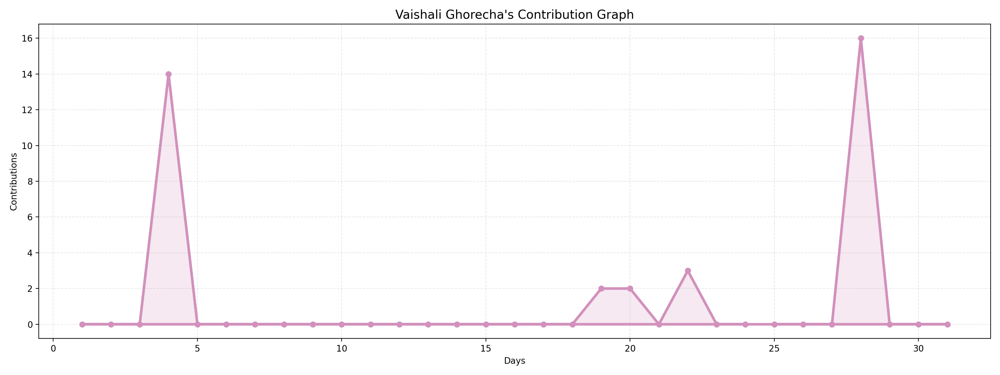

<h1 align="center">Hi there 👋, I am Vaishali Ghorecha</h1>

<h3 align="center">
 🧠 Data Scientist | 📊 Data Analyst | ⚡ Business Intelligence | 🧩 Business Analyst
</h3>
           

  

<h2>🌟 About Me</h2>

<ul>
  <li>✨ <b>Data Storyteller  : </b> I uncover hidden insights, turn complexity into clarity, and help teams make decisions with confidence.</li>
  <li>📈 <b>Insight-Driven Professional</b> : </b> I transform raw data into meaningful insights that support strategic, data-driven decision-making.</li> 
  <li>🧠 <b>Analytical Problem Solver : </b> Skilled in exploring complex datasets, identifying patterns, and building solutions using Python, SQL, Machine Learning, and BI tools.</li>
  <li>📊 <b>Data Visualization Expert : </b> I design interactive dashboards and reports that clearly communicate trends, KPIs, and business performance.</li> 
  <li>🚀 <b>Growth-Focused Mindset : </b> Continuously learning, improving my technical skill set, and applying best practices to deliver real-world business impact.</li> 
</ul>

<h2>⚡ What I Love to Build</h2>

<ul>
  <li>📊 <b>Interactive Dashboards:</b> Power BI, Tableau, MS Excel</li>
  <li>🏆 <b>Machine Learning Projects:</b> Predictions, Metrics, Hyperparameter Tunning </li>
  <li>🔄 <b>Automations:</b> SQL + Python for Smart Workflows</li>
  <li>🔍 <b>Data Pipelines:</b> ETL, Data Wrangling, Model Development</li>
  <li>🤖 <b>ML Experiments:</b> AI insights for business</li>
</ul>

<h2>🧰 Tech Stack</h2>

  

<ul>
  <li><b>Programing Languages :</b> Python | SQL </li>
  <li><b>Databases :</b> MySQL | PostgreSQL | SQL Server</li>
  <li><b>Visualization :</b> Power BI | Tableau | MS Excel | Google Sheet | Matplotlib | Seaborn</li>
  <li><b>Data Handling :</b> Pandas | NumPy | ETL Pipelines</li>
  <li><b>Machine Learning :</b> Scikit learn | Supervised & Unsupervised Machine Learning, Statistics </li>
  <li><b>Tools :</b> VS Code | Jupyter Notebook | Kaggle | Pycharm</li>
</ul>

<h2>📈 GitHub By The Numbers</h2>

<ul>
  <li>👀 Profile Views</li>
  <li>📊 Activity Graph</li>

</ul>

<h2>💬 Let’s Connect</h2>

<ul>

  
  
  

 
</ul>

⚡ <b>Ready to collaborate</b> on data-driven projects, freelance work, or fresh ideas?  
Let’s turn raw data into real impact — together! 🚀

